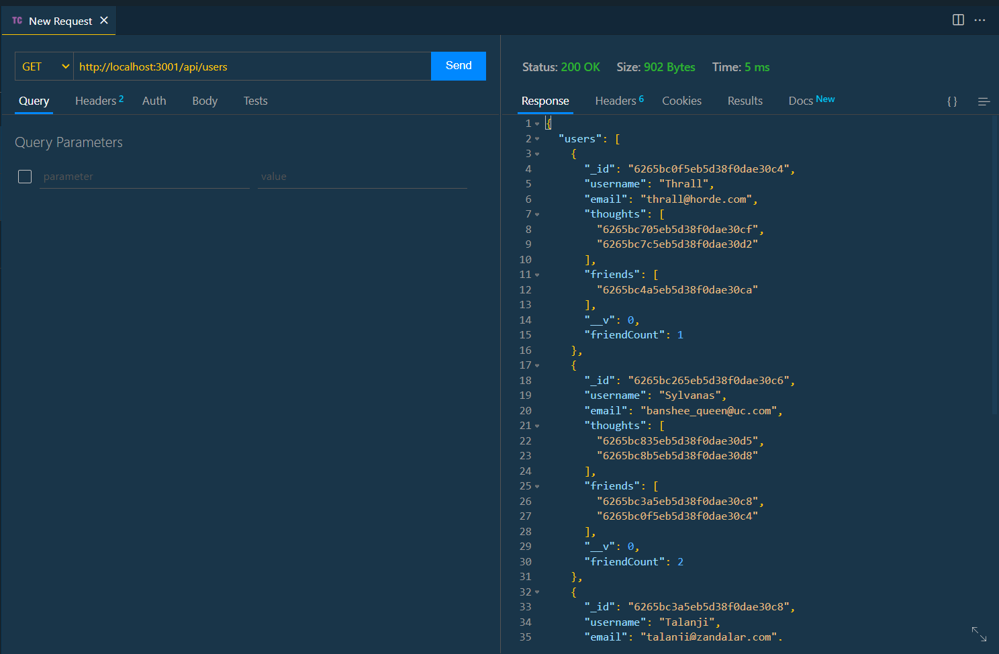

# Chatterbox


## Description

- Purpose of this project: An api for a social network that uses a NoSQL database
- Problem(s) the app solves: Not having a back end for a social network.
- Languages used: JavaScript
- Brief description: An API back end for a social network where users can create users and thoughts and add friends to user's friends list and reactions to thoughts. The user can also update users and thoughts and add and remove friends and reactions.

## Table of Contents

- [Installation](#installation)
- [Usage](#usage)
- [Screenshots](#screenshots)
- [License](#license)
- [Contributing](#contributing)
- [Tests](#tests)
- [Questions](#questions)
- [Links](#links)

## Installation

This app requires the installation of express and mongoose to function. All are included in the package.json file and can be installed with the following input:

```bash
npm install
```

## Usage

The user invokes the in-terminal application with the following input:

```bash
nodemon
```

The server is then started and the Mongoose models are synced to the MongoDB database. When the user opens API GET routes in Thunder Client for users and thoughts, the data for each of these routes is displayed in a formatted JSON. When they test API POST, PUT, and DELETE routes in Thunder Client, they are able to successfully create, update, and delete users and thoughts in their database. When a thought is deleted, its thought id is also deleted from the user data. When the user tests API, POST, and DELETE routes in Thunder Client, they are able to successfully create and delete reactions to thoughts and add and remove friends to a user’s friend list.

## Screenshots

### Screenshot of the GET route to get all users



### Screenshot of the GET route to get a single user by user id


### Screenshot of the GET route to get all thoughts


### Screenshot of the GET route to get a single thought by thought id


## License

This application is licensed under the MIT license.

## Contributing

If you would like to contribute to this application, please follow Creative Contribution guidelines.

## Tests

Use Thunderclient to test the api routes.

## Questions

If you have any questions:

- Email me: [meegan.r.anderson@gmail.com](mailto:meegan.r.anderson@gmail.com)
- Go to my github: [NotANewt](https://github.com/NotANewt)

## Links

- Here is the repo: [NotANewt/Chatterbox](https://github.com/NotANewt/chatterbox)
- Here is a link to the first part of the video walkthrough: [Video Walkthrough/ User Routes](https://drive.google.com/file/d/1RzQVb0jvjtgxp3KlcHovFtPqqFT7M8o_/view)
- Here is a link to the second part of the video walkthrough: [Video Walkthrough/ Thought Routes](https://drive.google.com/file/d/17H95ThrHN-bsVSZ9vKL30l-0POhbxo_E/view)
